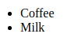
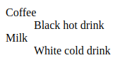

# 列表

### 无序列表

无序列表是一个项目的列表，此列项目使用粗体圆点（典型的小黑圆圈）进行标记。

无序列表始于` <ul> `标签。每个列表项始于 `<li>`。

```html
<ul>
    <li>Coffee</li>
    <li>Milk</li>
</ul>
```



### 有序列表

同样，有序列表也是一列项目，列表项目使用数字进行标记。

有序列表始于 `<ol>` 标签。每个列表项始于` <li> `标签。

```html
<ol>
    <li>Coffee</li>
    <li>Milk</li>
</ol>
```


### 定义列表

自定义列表不仅仅是一列项目，而是项目及其注释的组合。

自定义列表以 `<dl>` 标签开始。每个自定义列表项以 `<dt>` 开始。每个自定义列表项的定义以`<dd>` 开始。

```html
<dl>
    <dt>Coffee</dt>
    <dd>Black hot drink</dd>
    <dt>Milk</dt>
    <dd>White cold drink</dd>
</dl>
```



