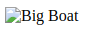

# 图像

### 图像标签（``）和源属性（src）

在 HTML 中，图像由 `` 标签定义。

`` 是空标签，意思是说，它只包含属性，并且没有闭合标签。

要在页面上显示图像，你需要使用源属性（src）。src 指 "source"。源属性的值是图像的 URL 地址，可以是本地资源也可以是外链。

```html

```

### 替换文本属性（Alt）

alt 属性用来为图像定义一串预备的可替换的文本。替换文本属性的值是用户定义的。

```html

```



