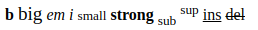
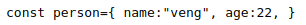
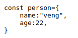
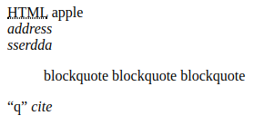

# 文本格式化

### 文本格式化标签

| 标签       | 描述                                  |
| :--------- | :------------------------------------ |
| `<b>`      | 定义粗体文本。                        |
| `<big>`    | 定义大号字。                          |
| `<em>`     | 定义着重文字。                        |
| `<i>`      | 定义斜体字。                          |
| `<small>`  | 定义小号字。                          |
| `<strong>` | 定义加重语气。                        |
| `<sub>`    | 定义下标字。                          |
| `<sup>`    | 定义上标字。                          |
| `<ins>`    | 定义插入字。                          |
| `<del>`    | 定义删除字。                          |
| `<s>`      | *不赞成使用。*使用 `<del>` 代替。     |
| `<strike>` | *不赞成使用。*使用 `<del>` 代替。     |
| `<u>`      | *不赞成使用。*使用样式（style）代替。 |

```html
<b>b</b>
<big>big</big>
<em>em</em>
<i>i</i>
<small>small</small>
<strong>strong</strong>
<sub>sub</sub>
<sup>sup</sup>
<ins>ins</ins>
<del>del</del>
```

效果：



### 计算机输出标签

| 标签     | 描述                 |
| :------- | :------------------- |
| \<code\> | 定义计算机代码。     |
| \<kbd\>  | 定义键盘码。         |
| \<samp\> | 定义计算机代码样本。 |
| \<tt\>   | 定义打字机代码。     |
| \<var\>  | 定义变量。           |
| \<pre\>  | 定义预格式文本。     |

```html
    <code>code</code>
    <kbd>kbd</kbd>
    <samp>samp</samp>
    <tt>tt</tt>
    <var>var</var>
    <pre>pre</pre>
```


效果：


感觉没啥区别，但是在markdown里就有一样的变化,如下：

<code>code</code><kbd>kbd</kbd><samp>samp</samp>

<tt>tt</tt></var>var</var> <pre>pre</pre>

<font color=red>注意</font>,`<code> `元素不保留多余的空格和折行.

```html
    <code>
        const person={
            name:"veng",
            age:22,
        }
    </code>
```



如需解决该问题，您必须在 `<pre>` 元素中包围代码：

```html
<pre>
const person={
    name:"veng",
    age:22,
}
</pre>
```



### 引用和术语定义

```html
<!--abbr 定义缩写，其实也没啥吊用，跟其他可以加title的标签一样-->
    <abbr title="Hyper Text Markup Language">HTML</abbr>
<!--acronym 定义首字母缩写,不建议使用-->
    <acronym>apple</acronym>
<!--address 定义地址-->
    <address><bdo dir="ltr">address</bdo></address>
<!--bdo 定义文字方向,有两种方向，正序逆序-->
    <address><bdo dir="rtl">address</bdo></address>
<!--定义长的引用-->
<!--<blockquote> 与 </blockquote> 之间的所有文本都会从常规文本中分离出来，
经常会在左、右两边进行缩进（增加外边距），而且有时会使用斜体。也就是说，
块引用拥有它们自己的空间。-->
    <blockquote>
        blockquote
        blockquote
        blockquote
    </blockquote>
<!--定义短的引用语-->
    <q>q</q>
<!--定义引用、引证-->
    <cite>cite</cite>
```

效果：



